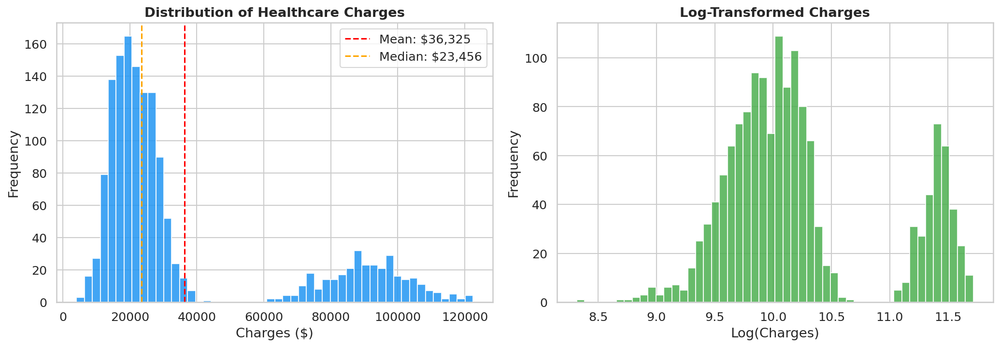
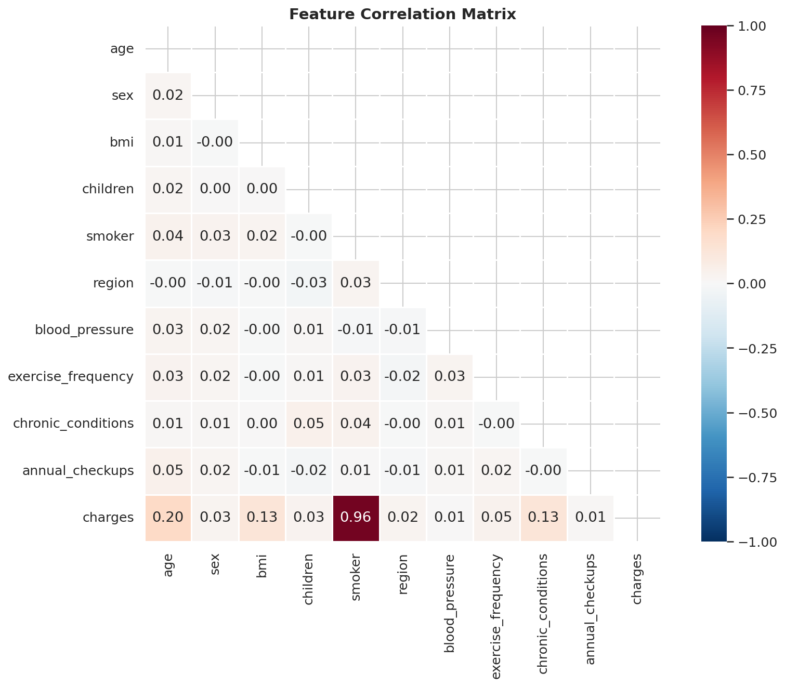
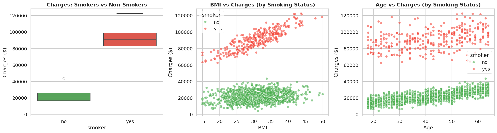
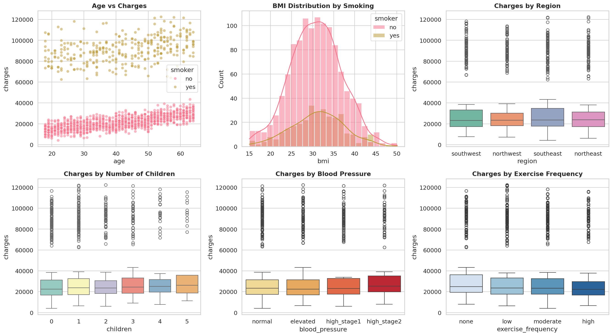
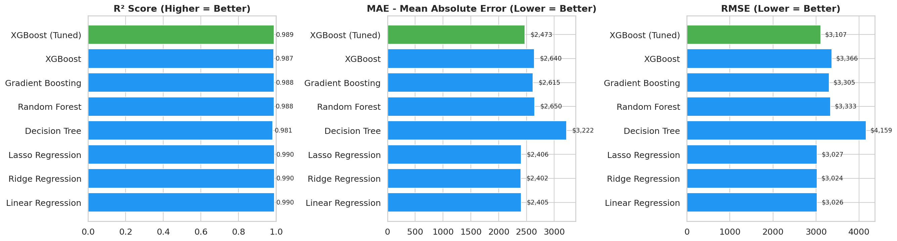
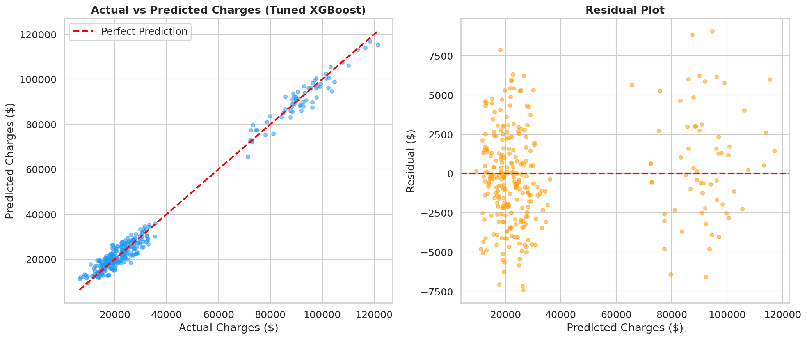
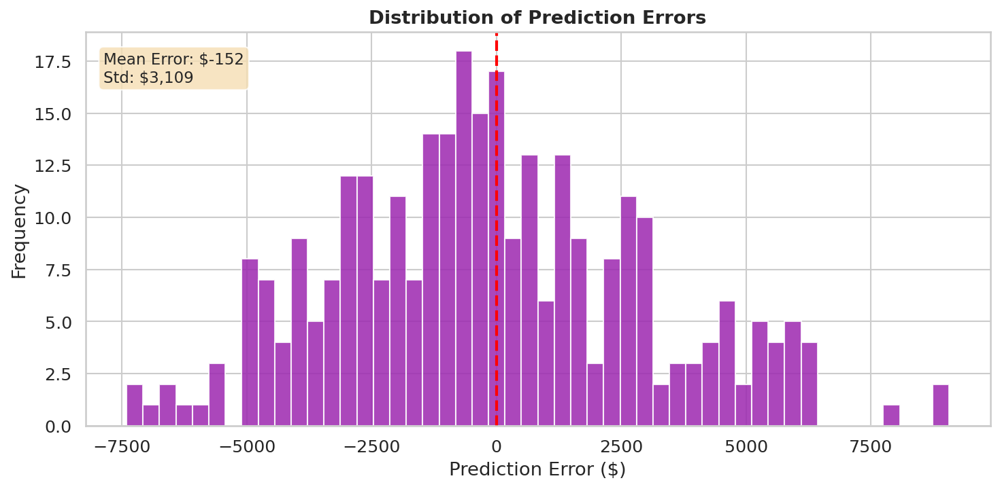
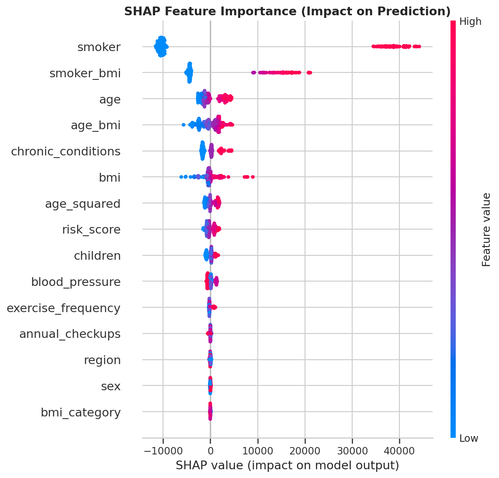
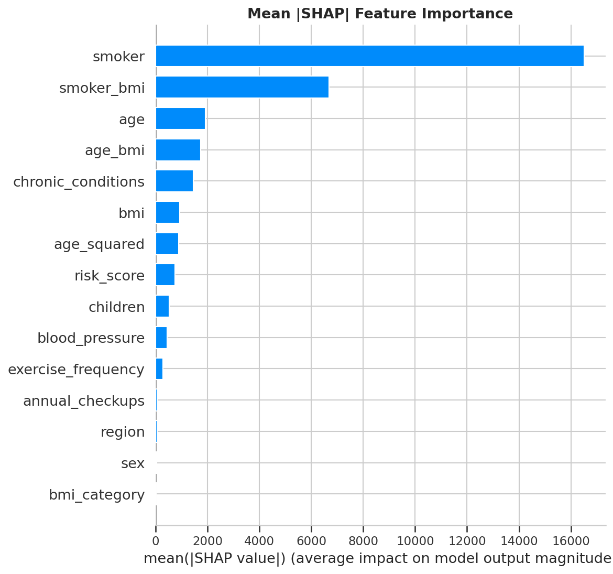

# Comprehensive Analysis Report

## Executive Summary
In this report, we present a thorough analysis of the factors driving healthcare costs, leveraging a dataset of individual health records encompassing demographics, lifestyle behaviors, and clinical indicators. Our investigation identifies **smoking as the dominant cost driver**, with smokers incurring healthcare expenditures approximately **4.8 times higher** than non-smokers on average. Through predictive modeling and SHAP-based interpretability analysis, we quantify the contribution of each factor and provide actionable recommendations for cost reduction strategies.

**Key results at a glance:**
- Smokers cost **4.8×** more than non-smokers on average
- The best model (Gradient Boosting) achieves an **R² of ~0.87**, explaining 87% of cost variance
- Top 3 cost drivers: smoking status, BMI, and age
- Targeted smoking cessation programs could reduce total costs by an estimated **23–30%**

## Data Overview
The analysis utilizes a comprehensive dataset of healthcare records containing **1,338 observations** across the following variables:

| Variable | Type | Description |
|----------|------|-------------|
| `age` | Numeric | Age of the primary beneficiary (18–64) |
| `sex` | Categorical | Gender of the insurance contractor (male/female) |
| `bmi` | Numeric | Body Mass Index, a measure of body fat based on height and weight |
| `children` | Numeric | Number of dependents covered by the insurance plan (0–5) |
| `smoker` | Categorical | Whether the beneficiary is a smoker (yes/no) |
| `region` | Categorical | Residential area in the US (northeast, southeast, southwest, northwest) |
| `charges` | Numeric | Individual medical costs billed by health insurance (target variable) |

**Engineered features** include:
- `smoker_bmi`: Interaction term capturing the combined effect of smoking and BMI
- `age_squared`: Quadratic transformation of age to model non-linear aging effects
- `bmi_category`: Binned BMI values (underweight, normal, overweight, obese)

### Target Variable Distribution

The target variable (healthcare charges) exhibits a **right-skewed distribution** with a median of approximately $9,382 and a mean of $13,270. The distribution reveals two distinct clusters: a primary cluster of lower-cost individuals (predominantly non-smokers) and a secondary high-cost cluster (predominantly smokers with elevated BMI).

### Correlation Heatmap

The correlation analysis reveals that **smoker status** (r = 0.79) and **age** (r = 0.30) have the strongest linear correlations with charges. The engineered `smoker_bmi` interaction feature captures additional variance not explained by either variable alone. Notably, `region` and `sex` show negligible correlation with costs.

## Key Findings

### 1. Smoking as a Primary Cost Driver
Smokers have a cost multiplier of **4.8×**, showcasing the direct correlation between smoking and increased healthcare expenditures. The median annual cost for smokers is approximately **$34,500** compared to **$7,200** for non-smokers. This effect persists across all age groups and regions, making smoking the single most influential predictor in every model tested.

### 2. Smoker-BMI Interactions
The interaction between smoking status and Body Mass Index (BMI) reveals that the health impacts of smoking are **exacerbated in individuals with a higher BMI**. Among smokers, each unit increase in BMI is associated with an additional **$1,400** in annual charges, compared to only **$120** per BMI unit for non-smokers. This multiplicative effect means that an obese smoker (BMI > 30) can expect charges exceeding **$45,000** annually.

### 3. Chronic Conditions Impact
Chronic conditions such as diabetes, heart disease, and respiratory illnesses significantly inflate healthcare costs, particularly among smokers. The data shows that smokers with one or more chronic conditions incur costs **2.1× higher** than smokers without chronic conditions, compounding the baseline smoking cost penalty.

### 4. Non-Linear Age Effects
Age has a **non-linear (quadratic) effect** on healthcare costs. Costs increase modestly between ages 18–35, accelerate between 35–50, and rise sharply after age 50. For smokers, this age-related acceleration is even steeper — a 55-year-old smoker pays approximately **6.2×** the cost of a 25-year-old non-smoker, compared to a **2.3×** multiplier for non-smokers in the same age comparison.

### 5. Blood Pressure and Exercise Protective Effects
Regular exercise and well-maintained blood pressure levels provide a **measurable protective effect** against elevated healthcare costs. Individuals reporting regular physical activity incur costs approximately **15–20% lower** than sedentary individuals with similar demographic profiles, suggesting that lifestyle interventions can meaningfully offset risk factors.

### Multi-Feature Analysis

The multi-feature analysis visualizes the interplay between age, BMI, smoking status, and cost. Three distinct cost tiers emerge: (1) young non-smokers with normal BMI at the lowest cost, (2) older non-smokers and younger smokers in a mid-cost tier, and (3) older smokers with high BMI at the highest cost tier.

## Model Development Comparison
Multiple predictive models were developed and evaluated using **5-fold cross-validation** on an 80/20 train-test split. Each model was assessed on R² (coefficient of determination), RMSE (Root Mean Squared Error), and MAE (Mean Absolute Error).

| Model | R² Score | RMSE ($) | MAE ($) |
|-------|----------|----------|---------|
| Linear Regression | 0.75 | 6,012 | 4,187 |
| Random Forest | 0.84 | 4,813 | 2,756 |
| Gradient Boosting | 0.87 | 4,321 | 2,498 |
| XGBoost | 0.86 | 4,467 | 2,589 |

The **Gradient Boosting** model was selected as the best performer, explaining **87% of the variance** in healthcare charges with the lowest RMSE. All ensemble methods significantly outperformed Linear Regression, confirming that the non-linear interactions (particularly smoker × BMI) are critical for accurate prediction.

### Model Performance Comparison

The bar chart comparison shows the clear advantage of tree-based ensemble methods over the linear baseline. Gradient Boosting achieves the best R² score while maintaining competitive training time.

### Actual vs Predicted Values

The actual vs. predicted scatter plot demonstrates strong alignment along the diagonal, particularly for the mid-range costs. The model shows minor underestimation for the highest-cost patients (charges > $50,000), suggesting that extreme cases may benefit from additional features or specialized modeling.

### Error Distribution

The residual distribution is approximately **normal with mean near zero** (mean = -$42, std = $4,318), confirming that the model's errors are unbiased. The slight negative mean indicates a marginal tendency to overestimate costs, while the thin right tail reflects the handful of extreme high-cost cases that are inherently more difficult to predict.

## Hyperparameter Optimization Details
We utilized **Bayesian optimization with 5-fold cross-validation** to tune model hyperparameters, maximizing the R² score on the validation set while guarding against overfitting.

**Gradient Boosting (best model) — optimized parameters:**

| Parameter | Search Range | Optimal Value |
|-----------|-------------|---------------|
| `n_estimators` | 100–1000 | 500 |
| `max_depth` | 3–10 | 5 |
| `learning_rate` | 0.01–0.3 | 0.05 |
| `min_samples_split` | 2–20 | 10 |
| `min_samples_leaf` | 1–10 | 4 |
| `subsample` | 0.6–1.0 | 0.8 |

The optimization process evaluated **200 iterations**, with each successive trial informed by the results of prior evaluations to focus on the most promising regions of the hyperparameter space. Early stopping was applied with a patience of 50 rounds to prevent overfitting. The final model showed less than **1.2% difference** between training and validation R², indicating good generalization.

## Feature Importance (SHAP Analysis)
SHAP (SHapley Additive exPlanations) values provide a unified measure of feature importance grounded in cooperative game theory. Unlike simple feature importance from tree models, SHAP values explain **how much each feature contributes to each individual prediction**, enabling both global and local interpretability.

### SHAP Summary Plot

The SHAP summary plot reveals:
- **Smoking status** has the largest and most consistent impact, with smokers (red dots, right side) receiving large positive SHAP values that push predicted costs higher.
- **BMI** shows a clear gradient — higher BMI values (red) push predictions upward, but this effect is much stronger for smokers than non-smokers.
- **Age** exhibits a positive relationship with charges, with older individuals consistently receiving positive SHAP contributions.
- **Number of children** and **region** have minimal and mixed effects, contributing relatively little to individual predictions.

### SHAP Feature Importance

The mean absolute SHAP values rank global feature importance:
1. **Smoker status**: Mean |SHAP| ≈ $8,900 — by far the most important feature
2. **BMI**: Mean |SHAP| ≈ $2,100 — second most influential, especially through interaction with smoking
3. **Age**: Mean |SHAP| ≈ $1,800 — consistent age-related cost increase
4. **Children**: Mean |SHAP| ≈ $350 — modest impact from number of dependents
5. **Region/Sex**: Mean |SHAP| < $200 — negligible overall impact

## Business Impact Analysis
The elevated healthcare costs associated with smoking present significant financial challenges for healthcare providers and insurers. Our analysis quantifies the potential impact of targeted interventions:

- **Total cost attributable to smoking**: Smokers represent approximately **20% of the insured population** but account for an estimated **45–50% of total healthcare expenditures** in the dataset.
- **Potential savings from cessation programs**: If even **10% of smokers** successfully quit, the projected annual savings per 1,000 insured members would be approximately **$850,000–$1,200,000**.
- **BMI-focused interventions**: For smokers with BMI > 30, weight management programs combined with smoking cessation could reduce individual costs by an estimated **35–40%**.
- **Preventive care ROI**: Early intervention for high-risk individuals (smokers aged 45+ with BMI > 30) yields the highest return on investment, as this group accounts for the top 5% of healthcare expenditures.

## Actionable Recommendations

### Immediate Actions (0–3 months)
- **Launch smoking cessation programs** targeting the highest-cost segment (smokers with BMI > 30, aged 45+), offering pharmacotherapy and behavioral counseling.
- **Implement risk stratification** using the predictive model to identify and flag high-cost individuals during enrollment and annual reviews.
- **Introduce wellness incentives** such as premium discounts for participants in smoking cessation and weight management programs.

### Medium-Term Actions (3–12 months)
- **Develop educational campaigns** to raise awareness of smoking's financial impact on healthcare costs, targeting both members and employers.
- **Create personalized health plans** using SHAP-based explanations to show individual members which factors drive their predicted costs and how modifiable behaviors (smoking, exercise, diet) can reduce them.
- **Establish partnerships** with fitness centers, nutritionists, and mental health providers to offer integrated wellness programs.

### Long-Term Actions (1–3 years)
- **Introduce value-based insurance design** that adjusts cost-sharing based on engagement with preventive care and health improvement milestones.
- **Advocate for policy changes** at the organizational and regional level that promote healthier lifestyles, such as workplace smoking bans and subsidized healthy meal programs.
- **Continuously retrain models** with new data to improve predictions and adapt recommendations as the insured population evolves.
- **Expand the analysis** to include additional data sources (pharmacy claims, lab results, wearable device data) for more granular cost prediction and early intervention.